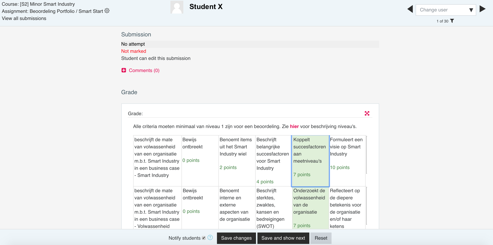

```{r message=FALSE, warning=FALSE}
library(formattable)
```


# Inleiding

De Minor Smart Industry (MSI) van de Hogeschool Arnhem en Nijmegen is een verbredende Minor en wordt sinds 2016/17 aangeboden. Studenten vanuit verschillende opleidingen verkennen nieuwe technologieën en leren hoe hiermee waarde kan worden gecreëerd. Tijdens het studietraject leren ze het belang van samenwerking, kennisdeling en continuous improvement voor het innovatievermogen van organisaties.

Bij het thema Smart Industry spelen zaken als innovatie en disruptie een belangrijke rol. Dit houdt in dat omgang met onzekerheid, initiatief nemen en creatief vermogen succesfactoren zijn, zowel voor de individuele professional als de organisatie die Smart(er) wil worden. 

```{r smartindustry, echo=FALSE, fig.align='center', fig.cap="Smart Industry model", out.width="40%", warning=FALSE}
knitr::include_graphics('images/smartindustry.jpg')
```

Het studieprogramma bestaat uit vijf onderdelen/modules:

* Smart Start - Onderzoek en communicatie en professionele ontwikkeling
* Smart Business - Bedrijfskundige toepassingen van Smart Technologies
* Smart Connection - Digitalisering en netwerken
* Smart Technology - Hardware
* Project

In dit portfolio zal de kwaliteit van de toetscyclus binnen Smart Start worden doorgenomen en besproken. Dit onderdeel heeft een aandeel van 20% in het gehele programma (6 ECTS / 168 SBU). Studenten moeten bewijzen dat ze zich op een set competenties hebben ontwikkeld d.m.v. een aantal leeruitkomsten.

```{r echo=FALSE}
Competentie <- c("Herkennen / Analyseren / Diagnosticeren", "Communiceren", "Professionaliseren")
Leeruitkomst <- c("Student beschrijft de mate van volwassenheid van een organisatie m.b.t. Smart Industry in een business case", "Student communiceert op effectieve wijze zijn bevindingen naar verschillende doelgroepen", "Student werkt actief aan zijn professionele ontwikkeling")

compDf <- data.frame(Competentie, Leeruitkomst)
formattable(compDf, align="l")
```

# Toetscyclus

```{r toetscyclus, echo=FALSE, fig.align='center', fig.cap="Toetscyclus", out.width="40%", warning=FALSE}
knitr::include_graphics('images/toetscyclus.png')
```

Om de kwaliteit van het toetsingsproces van Smart Start te beoordelen zijn alle stappen uit de toetscyclus doorgenomen en geanalyseerd.

## Basisontwerp

Gezien het brede character van de competenties en de eerdergenoemde succesfactoren is ervoor gekozen om niet volgens een strak toetsprogramma te werken. Studenten kunnen op meerdere momenten tijdens het semester bewijslast aanleveren ten behoeve van de verschillende leeruitkomsten. Hiermee kunnen ze hun groei naar en bereiken van afzonderlijke comptenties aantonen (continuous assessment). Ze hebben maximale autonomie wat betreft de vorm, inhoud en volgorde.

Uit onderzoek blijkt dat continuous assessment als toetsvorm drie voordelen biedt voor het leereffect van de student [@dayExplainingIndividualStudent2018b]. Ten eerste is er het zogenaamde testing effect [@roediger2006power] oftewel de kracht van herhaling. Door vaker te oefenen met de materie blijft informatie beter beklijven. Een volgend voordeel van continuous assessment is het spacing effect. Door meer tijd in te bouwen tussen herhalingen van studiestof, wordt het leereffect verhoogd [@kornell2009optimising]. Het derde effect heeft te maken met reflectie [@moon1999reflection]. Anders dan bij eenmalig toetsen, biedt herhaald toetsen ruimte voor de student om te reflecteren op zijn prestaties.

Binnen de context van de Minor is er nog een aanvullend positief effect. Door meer casussen te onderzoeken, creëert de student een grotere ervaringsset, waaruit hij later meer inspiratie kan putten.


## Ontwerp toetsmatrijs

Een toetsmatrijs is een instrument waarmee de toetsontwerper kan beoordelen in welke mate de toets daadwerkelijk alle geformuleerde leeruitkomsten meet en of de manier van meten voldoende betrouwbaar is (bijv. of iedere student op hetzelfde niveau wordt getest).

Het helpt de constructeur bovendien zich te beperken tot een vragenset die MECE is - volledig en zonder overlap. Dit bespaart tijd bij het maken van de toets en de beoordeling [@AnimationHowCreate].

Een toetsmatrijs bestaat uit twee dimensies, namelijk de leeruitkomsten en het cognitieve niveau dat wordt getoetst.

### Leeruitkomsten
Voordat begonnen wordt met de formulering van de leeruitkomsten, is het nuttig te beslissen waarom een specifiek onderwerp bestudeerd moet worden [@biggs2014evaluating]:

* Om kaders aan de brengen, zodat studenten weten 'wat er allemaal speelt'
* Om studenten op de hoogte te brengen van de actuele stand der dingen, zodat studenten over de nieuwste kennis beschikken
* Om kennis aan te brengen die wellicht nu nog niet nodig is, maar waarschijnlijk later wel nuttig zal zijn
* Zodat er een kennisfundament is waarop complexe beslissingen kunnen worden genomen in de nabije toekomst, zoals in probleemgestuurd onderwijs

Voor de Minor in zijn algemeenheid gelden met name de laatste twee items. De onderwerpen die bij MSI aan bod komen gaan over technologieën en toepassingen die nog niet mainstream zijn, in ieder geval niet bij het MKB. Tevens wordt verwacht dat studenten na het voltooien van de Minor goed geïnformeerd zijn over de keuzes die gemaakt kunnen worden en welke afwegingen hierbij horen.

Een leeruitkomst bevat minimaal drie componenten:

1. een gedragscomponent: wat moet de studenten doen/laten zien.
2. een inhoudscomponent: ten aanzien van welk onderwerp wordt de handeling uitgevoerd (het wat)
3. voorwaarden/context waarin (het hoe)

In het geval van de leeruitkomsten voor Smart Start ontstaat volgende ontleding:

```{r echo=FALSE}
Leeruitkomst <- c("Student beschrijft de mate van volwassenheid van een organisatie m.b.t. Smart Industry in een business case", "Student communiceert op effectieve wijze zijn bevindingen naar verschillende doelgroepen", "Student werkt actief aan zijn professionele ontwikkeling")
Gedrag <- c("Beschrijft", "Communiceert", "Werkt")
Inhoud <- c("Volwassenheid organisatie", "Bevindingen", "Ontwikkeling")
Context <- c("Smart Industry", "Verschillende doelgroepen", "Professioneel")

leeruitkomstenDf <- data.frame(Leeruitkomst, Gedrag, Inhoud, Context)
formattable(leeruitkomstenDf, align="l")
```

### Cognitieve niveau's / begripsniveau's

Nadat de leeruitkomsten zijn gedefinieerd, dient per leeruitkomst het verwachtte cognitieve niveau te worden beschreven. Eerder waren al een aantal redenen geformuleerd waarom een onderwerp belangrijk is voor de ontwikkeling van de studenten. Iedere afzonderlijke reden impliceert een ander niveau van cognitie.

Om de verschillende cognitieve niveau's te kunnen onderscheiden zijn een aantal taxonomieën ontworpen. Hieronder worden er twee gepresenteerd, de herziene versie van Bloom [@krathwohl2009taxonomy] en het hiërarchisch systeem volgens SOLO [@biggs2014evaluating].


```{r bloom, echo=FALSE, fig.align='center', fig.cap="Bloom's Taxonomie voor cognitieve leerniveau's", out.width="80%", warning=FALSE}
knitr::include_graphics('images/bloom.jpg')
```


```{r solo, echo=FALSE, fig.align='center', fig.cap="Structure of the Observed Learning Outcome (SOLO) Taxonomie voor begripsniveau's", out.width="80%", warning=FALSE}
knitr::include_graphics('images/solotaxonomy.png')
```

Voor de module Smart Start hebben we een systeem ontworpen van vier denkniveau's. Deze niveau's kunnen worden terugvertaald naar bovenstaande taxonomieën:

```{r echo=FALSE}
SmartStart <- c("Niveau 4", "Niveau 3", "Niveau 2", "Niveau 1")
Bloom <- c("Evaluatie en Creatie", "Toepassing en Analyse", "Inzicht", "Reproductie")
SOLO <- c("Extended abstract", "Relational", "Multistructural", "Unistructural")

leeruitkomstenDf <- data.frame(SmartStart, Bloom, SOLO)
colnames(leeruitkomstenDf)[1] <- "Smart Start"
formattable(leeruitkomstenDf, align="l")
```

De leeruitkomsten zijn uitgesplitst naar leeraspecten en per denkniveau zijn werkwoorden gebruikt om deze te beschrijven. De werkwoorden komen uit de twee taxonomieën (in sommige gevallen is gebruikt gemaakt van [aanvullende lijsten](https://www.apu.edu/live_data/files/333/blooms_taxonomy_action_verbs.pdf))

Het resultaat is volgende toetsmatrijs. Het gestreefde eindniveau is aangegeven.

```{r toetsmatrijs, echo=FALSE, fig.align='center', fig.cap="Toetsmatrijs Smart Start", out.width="100%", warning=FALSE}
knitr::include_graphics('images/toetsmatrijs.png')
```

## Construeren toets en normen

Bij de Minor wordt sterk op gedrag gestuurd. Studenten krijgen alle ruimte om hun eigen leertraject te ontwerpen. Dit betekent dat ze ook mogen bepalen met welke bewijzen ze competenties en behaalde leerdoelen gaan aantonen. De afspraken hierover worden vastgelegd in een persoonlijke Smart Journey.

```{r journey, echo=FALSE, fig.align='center', fig.cap="Template Smart Journey", out.width="80%", warning=FALSE}
knitr::include_graphics('images/journey.png')
```

Ook over de criteria en normering worden van te voren afspraken gemaakt.De docent bewaakt dat deze overeenkomen met het beoogde cognitieve niveau.

## Afnemen

Studenten worden aangemoedigd om zo vaak mogelijk zaken ter beoordeling aan te bieden, niet alleen bij docenten, maar ook bij medestudenten en externen (bijvoorbeeld opdrachtgevers). De reden hiervoor is dat we de individuele student ruimschoots gelegenheid willen bieden om zijn eigen fouten te maken en hiervan te leren.

Uiteindelijk worden alle bewijzen verzameld in een persoonlijk portfolio. Een uitgebreid voorbeeld vind u [hier](https://minorsmart.github.io/personal-portfolio-coengoossens78/index.html).

```{r portfolio, echo=FALSE, fig.align='center', fig.cap="Screenshot online portfolio", out.width="80%", warning=FALSE}

```


## Beoordelen en verwerken

Voor het inleveren van portfolios worden persoonlijke repositories ingericht in [Github Classroom](https://classroom.github.com/). Gedurende het lopende programma kunnen studenten hier vrij in werken. Na afsluiting van de Minor, gaat het beheer automatisch over naar de opleiding en kunnen studenten geen aanpassingen meer doen.

```{r classroom, echo=FALSE, fig.align='center', fig.cap="Screenshot Github Classroom", out.width="80%", warning=FALSE}
knitr::include_graphics('images/classroom.png')
```

Het portfolio heeft de vorm van een webpagina. Studenten plaatsen een link naar de webpagina in een postbus op het Learning Management System (LMS) van de opleiding. Docenten kunnen het daar oppakken en kijken het werk na met behulp van een rubric. De rubric is rechtstreeks gekoppeld aan de toetsmatrijs en de niveau's zijn gekoppeld aan scores, waarbij een voldoende score pas start bij het streefniveau. Er is ruimte voor compensatie, echter de wegingen zijn zodanig dan een meerderheid van de leeruitkomsten op het gewenste niveau dient te zijn voor een voldoende.

```{r rubric, echo=FALSE, fig.align='center', fig.cap="Screenshot rubric op Moodle", out.width="80%", warning=FALSE}

```

## Registreren en communiceren

Zodra de docent zijn beoordeling heeft bewaard, krijgt de student een mailbericht van het LMS dat zijn werk is beoordeeld. Hij kan per leeruitkomst bekijken op welk niveau het bevonden is en de feedback lezen. Het LMS opent direct een nieuwe mogelijk tot inlevering, zodat de student zaken nogmaals zaken kan aanleveren ter beoordeling, mocht dit nodig zijn.

## Analyseren en Evalueren

Deze ronde van de Minor (semester 2 / collegejaar 2019/20) is de eerste maal dat bovenstaande toetsmatrijs zal worden toegepast.

Omdat er tijdens het traject van continuous assessment regelmatig contact is, kan veel feedback worden opgehaald over de kwaliteit van toetsing. Tevens is er voortdurend contact met de docenten van de overige modules (Business, Connection en Technology), die op dezelfde wijze toetsen.

Daarnaast worden studenten aangespoord om de periodieke kwaliteitssurvey's in te vullen. Hierin is een vraag opgenomen betreffende de toetsing.

```{r survey, echo=FALSE, fig.align='center', fig.cap="Screenshot Eindsurvey MSI", out.width="80%", warning=FALSE}

```

Gedurende de Minor wordt door de coördinator van het programma structureel overleg ingepland om de kwaliteit van het onderwijs en toetsing te bespreken. Alle verzamelde data wordt geanalyseerd en besproken.

# Verbetervoorstellen

Tijdens het schrijven van dit portfolio zag ik al een aantal zaken die in een volgende iteratie aandacht verdienen.

Ik verwacht met name bij het onderdeel analyseren en evalueren nog mogelijkheden tot verbetering. Mijn indruk is dat bijvoorbeeld het LMS nog beter kan worden benut en interventies kunnen worden ingebouwd waarmee het gedrag van studenten gedurende het programma nauwkeuriger kan worden gevolgd. Op basis van deze gegevens kunnen kritische succesfactoren worden geïndentificeerd. Deze informatie kan worden gebruikt ter verbetering van didactiek en toetsing.

Een ander aspect kwam tijdens de bespreking met de studenten naar voren. De vraag werd gesteld of voor de overige onderdelen soortgelijke toetsmatrijzen bestonden. Dit is nog niet het geval. Het lijkt me zeer belangrijk om met het onderwijzend team naar de toetscyclus te kijken en een aantal volgende verbeterstappen te maken.

Het voordeel hierbij is, dat we met continuous assessment in veel kortere tijd PDCA-iteraties kunnen doorlopen. Voor een optimale werking is het echter belangrijk dat op het gebied van toetsing een kwaliteitssyteem wordt afgesproken en dat aandachtspunten en verbeteringen centraal worden gedeeld.

# Persoonlijke reflectie

Bij het ontwerp van de Minor is aan het begin veel aandacht besteed aan toetsing en gedurende de jaren daarna hebben continue (kleine) aanpassingen plaatsgevonden. Er was echter nooit voldoende tijd voor een gedegen reflectie. Daarom was ik blij met deze gelegenheid en heb ik de exercitie als zeer nuttig ervaren.

Ik het gevoel dat op een aantal aspecten een wezenlijke kwaliteitsslag is gemaakt. Als eerste was het goed om de vraag te stellen om welke redenen er gekozen is voor continuous assessment en of deze redenen nog steeds valide zijn. Door in de literatuur op zoek te gaan naar legitieme argumenten en deze kritisch te vergelijken met de didactische visie, kreeg ik een scherper beeld van de doelstellingen van ons programma.

Vervolgens was het relatief makkelijk om voor de afzonderlijke leeruitkomsten de bijbehorende cognitieve niveau's te kiezen. De aanwijzingen uit de verschillende taxonomieën waren zeer waardevol bij de formulering van de criteria.

De uiteindelijke toetsmatrijs is voorgelegd aan de groep deelnemers van de Minor. De reacties waren zeer positief. Studenten gaven aan dat ze hiermee goed konden werken en een veel beter beeld hadden van de verwachtte kwaliteit van het op te leveren werk.

# Feedback

Ik hoop dat je tijdens het lezen iets van inspiratie hebt gevonden en ben zeer benieuwd naar je mening of vragen. Mocht je iets met mij willen delen dan kan dit via het onderstaande formulier.

<form
  action="https://formspree.io/xknbaeok"
  method="POST"
>
  <label>
    Naam:
    <input type="text" name="name" placeholder="Naam">
  </label>
  <label>
    Bericht:
    <textarea name="message" placeholder="Plaats hier opmerkingen of vragen ...."></textarea>
  </label>

  <button type="submit">Send</button>
</form>

# Bibliografie

<div id="refs"></div>

<!-- # (APPENDIX) Bijlagen {-}  -->

<!-- # Voorbeeld 1 -->

<!-- # Voorbeeld 2 -->