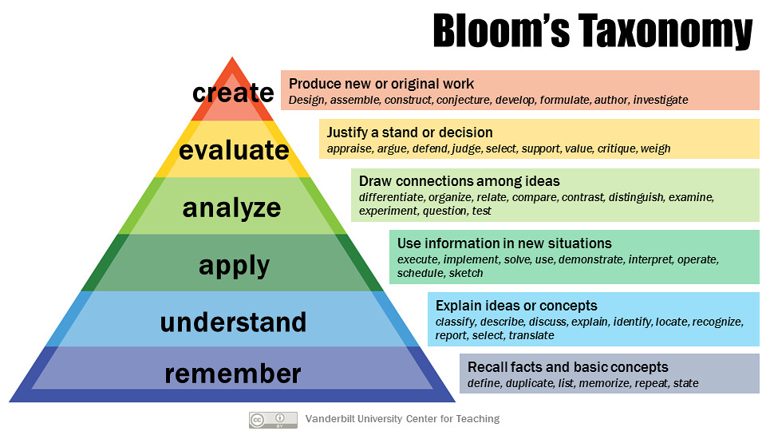
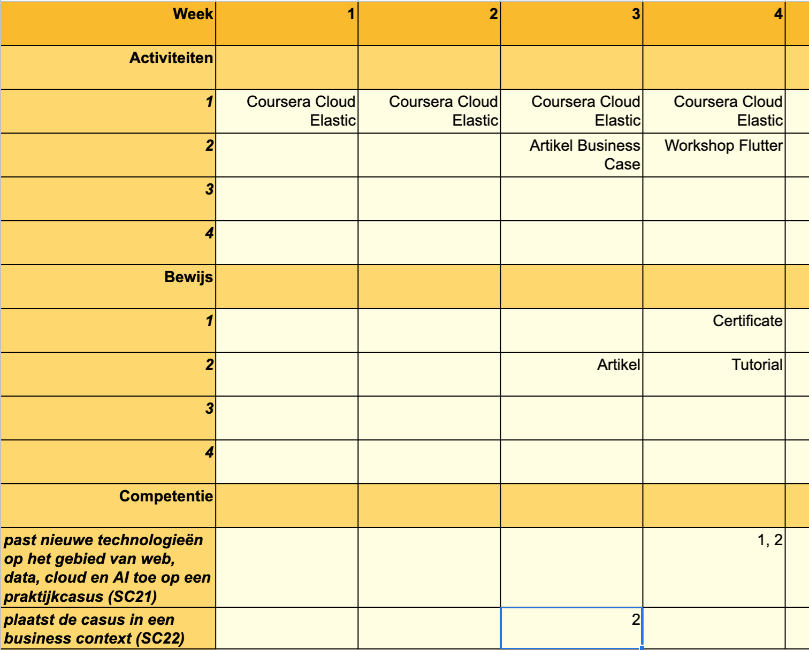
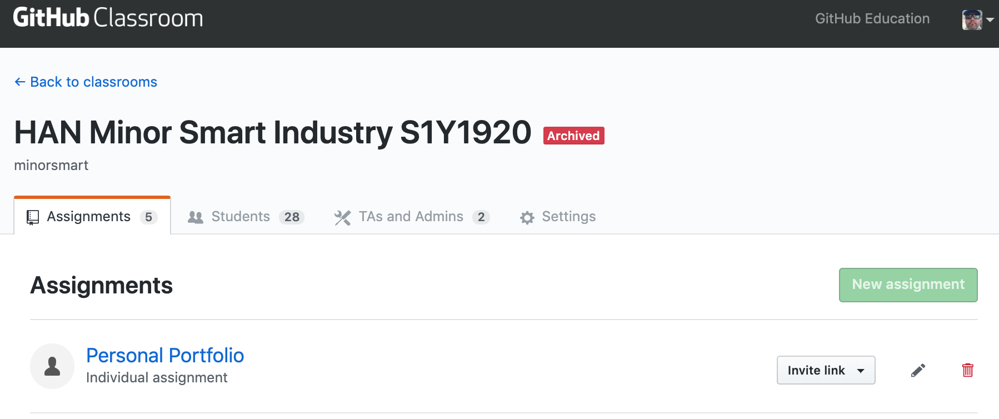

```{r global_options, echo=FALSE}
knitr::opts_chunk$set(fig.pos = 'h')
```

```{r echo=FALSE, message=FALSE, warning=FALSE}
library(knitr)
```

# Inleiding

De Minor Smart Industry (MSI) van de Hogeschool Arnhem en Nijmegen is een verbredende Minor. Studenten vanuit verschillende opleidingen verkennen nieuwe technologieën en leren hoe hiermee waarde kan worden gecreëerd. Tijdens het studietraject leren ze het belang van samenwerking, kennisdeling en continuous improvement voor het innovatievermogen van organisaties.

Bij het thema Smart Industry spelen zaken als innovatie en disruptie een belangrijke rol. Dit houdt in dat omgang met onzekerheid, initiatief nemen en creatief vermogen succesfactoren zijn, zowel voor de individuele professional als de organisatie die Smart(er) wil worden. 

```{r smartindustry, echo=FALSE, fig.align='center', fig.cap="Smart Industry model", warning=FALSE, out.width="40%"}
include_graphics('images/smartindustry.jpg')
```

Het studieprogramma bestaat uit vijf onderdelen/modules:

* Smart Start - Onderzoek en communicatie en professionele ontwikkeling
* Smart Business - Bedrijfskundige toepassingen van Smart Technologies
* Smart Connection - Digitalisering en netwerken
* Smart Technology - Hardware
* Project

In dit portfolio zal de toetscyclus binnen Smart Start worden doorgenomen en besproken. Dit onderdeel heeft een aandeel van 20% in het gehele programma (6 ECTS / 168 SBU). Studenten moeten bewijzen dat ze zich op een set competenties hebben ontwikkeld d.m.v. een aantal leeruitkomsten.

```{r echo=FALSE, fig.width=2}
Competentie <- c("Herkennen / Analyseren / Diagnosticeren", "Communiceren", "Professionaliseren")
Leeruitkomst <- c("Student beschrijft de mate van volwassenheid van een organisatie m.b.t. Smart Industry in een business case", "Student communiceert op effectieve wijze zijn bevindingen naar verschillende doelgroepen", "Student werkt actief aan zijn professionele ontwikkeling")

compDf <- data.frame(Competentie, Leeruitkomst)
knitr::kable(compDf, align = "l", format = "markdown", padding = 2)
```

\pagebreak

# Toetscyclus

Om de kwaliteit van het toetsingsproces van Smart Start te beoordelen zijn alle stappen uit de toetscyclus doorgenomen en geanalyseerd.

```{r toetscyclus, echo=FALSE, fig.align='center', fig.show='asis',fig.cap="Toetscyclus", out.width="40%", warning=FALSE}
include_graphics('images/toetscyclus.png')
```

Daarbij zijn volgende zaken opgevallen:

* Basisontwerp: ---
* Toetsmatrijs: ---
* Toetsconstructie en normering: ---
* Afnemen: ---
* Beoordelen, verwerken en analyseren: ---
* Registreren en communiceren: ---
* Evalueren

\pagebreak

## Basisontwerp

Gezien het brede character van de competenties en de eerdergenoemde succesfactoren is ervoor gekozen om niet volgens een strak toetsprogramma te werken. Studenten kunnen op meerdere momenten tijdens het semester bewijslast aanleveren ten behoeve van de verschillende leeruitkomsten. Hiermee kunnen ze hun groei naar en bereiken van afzonderlijke comptenties aantonen (continuous assessment). Ze hebben maximale autonomie wat betreft de vorm, inhoud en volgorde.

Uit onderzoek blijkt dat continuous assessment als toetsvorm drie voordelen biedt voor het leereffect van de student [@dayExplainingIndividualStudent2018b]. Ten eerste is er het zogenaamde testing effect [@roediger2006power] oftewel de kracht van herhaling. Door vaker te oefenen met de materie blijft informatie beter beklijven. Een volgend voordeel van continuous assessment is het spacing effect. Door meer tijd in te bouwen tussen herhalingen van studiestof, wordt het leereffect verhoogd [@kornell2009optimising]. Het derde effect heeft te maken met reflectie [@moon1999reflection]. Anders dan bij eenmalig toetsen, biedt herhaald toetsen ruimte voor de student om te reflecteren op zijn prestaties.

Binnen de context van de Minor is er nog een aanvullend positief effect. Door meer casussen te onderzoeken, creëert de student een grotere ervaringsset, waaruit hij later meer inspiratie kan putten.

\pagebreak

## Ontwerp toetsmatrijs

Een toetsmatrijs is een instrument waarmee de toetsontwerper kan beoordelen in welke mate de toets daadwerkelijk alle geformuleerde leeruitkomsten meet en of de manier van meten voldoende betrouwbaar is (bijv. of iedere student op hetzelfde niveau wordt getest).

Het helpt de constructeur bovendien zich te beperken tot een vragenset die MECE is - volledig en zonder overlap. Dit bespaart tijd bij het maken van de toets en de beoordeling [@AnimationHowCreate].

Een toetsmatrijs bestaat uit twee dimensies, namelijk de leeruitkomsten en het cognitieve niveau dat wordt getoetst.

\pagebreak

### Leeruitkomsten
Voordat begonnen wordt met de formulering van de leeruitkomsten, is het nuttig te beslissen waarom een specifiek onderwerp bestudeerd moet worden [@biggs2014evaluating]:

* Om kaders aan de brengen, zodat studenten weten 'wat er allemaal speelt'
* Om studenten op de hoogte te brengen van de actuele stand der dingen, zodat studenten over de nieuwste kennis beschikken
* Om kennis aan te brengen die wellicht nu nog niet nodig is, maar waarschijnlijk later wel nuttig zal zijn
* Zodat er een kennisfundament is waarop complexe beslissingen kunnen worden genomen in de nabije toekomst, zoals in probleemgestuurd onderwijs

Voor de Minor in zijn algemeenheid gelden met name de laatste twee items. De onderwerpen die bij MSI aan bod komen gaan over technologieën en toepassingen die nog niet mainstream zijn, in ieder geval niet bij het MKB. Tevens wordt verwacht dat studenten na het voltooien van de Minor goed geïnformeerd zijn over de keuzes die gemaakt kunnen worden en welke afwegingen hierbij horen.

Een leeruitkomst bevat minimaal drie componenten:

1. een gedragscomponent: wat moet de studenten doen/laten zien.
2. een inhoudscomponent: ten aanzien van welk onderwerp wordt de handeling uitgevoerd (het wat)
3. voorwaarden/context waarin (het hoe)

In het geval van de leeruitkomsten voor Smart Start ontstaat volgende ontleding:

```{r echo=FALSE}
Leeruitkomst <- c("Student beschrijft de mate van volwassenheid van een organisatie m.b.t. Smart Industry in een business case", "Student communiceert op effectieve wijze zijn bevindingen naar verschillende doelgroepen", "Student werkt actief aan zijn professionele ontwikkeling")
Gedrag <- c("Beschrijft", "Communiceert", "Werkt")
Inhoud <- c("Volwassenheid organisatie", "Bevindingen", "Ontwikkeling")
Context <- c("Smart Industry", "Verschillende doelgroepen", "Professioneel")

leeruitkomstenDf <- data.frame(Leeruitkomst, Gedrag, Inhoud, Context)
kable(leeruitkomstenDf, align="l")
```

\pagebreak

### Cognitieve niveau's / begripsniveau's

Nadat de leeruitkomsten zijn gedefinieerd, dient per leeruitkomst het verwachtte cognitieve niveau te worden beschreven. Eerder waren al een aantal redenen geformuleerd waarom een onderwerp belangrijk is voor de ontwikkeling van de studenten. Iedere afzonderlijke reden impliceert een ander niveau van cognitie.

Om de verschillende cognitieve niveau's te kunnen onderscheiden zijn een aantal taxonomieën ontworpen. Hieronder worden er twee gepresenteerd, de herziene versie van Bloom [@krathwohl2009taxonomy] en het hiërarchisch systeem volgens SOLO [@biggs2014evaluating].


```{r bloom, echo=FALSE, fig.align='center', fig.show='asis', fig.cap="Bloom's Taxonomie voor cognitieve leerniveau's", out.width="50%", warning=FALSE}

```

--------

```{r solo, echo=FALSE, fig.align='center', fig.cap="Structure of the Observed Learning Outcome (SOLO) Taxonomie voor begripsniveau's", out.width="50%", warning=FALSE}
include_graphics('images/solotaxonomy.png')
```

Beide systemen hanteren een hiërarchische orde van denken.

Voor de module Smart Start hebben we een systeem ontworpen van vier denkniveau's. Deze niveau's kunnen worden terugvertaald naar bovenstaande taxonomieën:

```{r echo=FALSE}
SmartStart <- c("Niveau 4", "Niveau 3", "Niveau 2", "Niveau 1")
Bloom <- c("Evaluatie en Creatie", "Inzicht, Toepassing en Analyse", "Reproductie", "--")
SOLO <- c("Extended abstract", "Relational", "Multistructural", "Unistructural")

leeruitkomstenDf <- data.frame(SmartStart, Bloom, SOLO)
colnames(leeruitkomstenDf)[1] <- "Smart Start"
kable(leeruitkomstenDf, align="l")
```

De leeruitkomsten zijn uitgesplitst naar leeraspecten en per denkniveau zijn werkwoorden gebruikt om deze te beschrijven. De werkwoorden komen uit de twee taxonomieën (in sommige gevallen is gebruikt gemaakt van [aanvullende lijsten](https://www.apu.edu/live_data/files/333/blooms_taxonomy_action_verbs.pdf))

Het resultaat is volgende toetsmatrijs. Het gestreefde eindniveau is aangegeven.

```{r toetsmatrijs, echo=FALSE, fig.align='center', fig.show='asis', fig.cap="Toetsmatrijs Smart Start", out.width="80%", warning=FALSE}
include_graphics('images/toetsmatrijs.png')
```

\pagebreak

## Construeren toets en normen

Bij de Minor wordt sterk op gedrag gestuurd. Studenten krijgen alle ruimte om hun eigen leertraject te ontwerpen. Dit betekent dat ze ook mogen bepalen met welke bewijzen ze competenties en behaalde leerdoelen gaan aantonen. De afspraken hierover worden vastgelegd in een persoonlijke Smart Journey.

```{r journey, echo=FALSE, fig.align='center', fig.cap="Template Smart Journey", out.width="40%", warning=FALSE}

```

Ook over de criteria en normering worden van te voren afspraken gemaakt. De docent bewaakt dat deze overeenkomen met het beoogde cognitieve niveau.

\pagebreak

## Afnemen

Studenten worden aangemoedigd om zo vaak mogelijk zaken ter beoordeling aan te bieden, niet alleen bij docenten, maar ook bij medestudenten en externen (bijvoorbeeld opdrachtgevers). De reden hiervoor is dat we de individuele student ruimschoots gelegenheid willen bieden om zijn eigen fouten te maken en hiervan te leren.

Uiteindelijk worden alle bewijzen verzameld in een persoonlijk portfolio. Een uitgebreid voorbeeld vind u [hier](https://minorsmart.github.io/personal-portfolio-coengoossens78/index.html).

```{r portfolio, echo=FALSE, fig.align='center', fig.cap="Screenshot online portfolio", out.width="40%", warning=FALSE}
include_graphics('images/portfolio.png')
```

\pagebreak

## Beoordelen, verwerken en analyseren

Voor het inleveren van portfolios worden persoonlijke repositories ingericht in [Github Classroom](https://classroom.github.com/). Gedurende het lopende programma kunnen studenten hier vrij in werken. Na afsluiting van de Minor, gaat het beheer automatisch over naar de HAN en kunnen studenten geen aanpassingen meer doen.

```{r classroom, echo=FALSE, fig.align='center', fig.cap="Screenshot Github Classroom", out.width="40%", warning=FALSE}

```

Rubric, Moodle Logs, Dataiku

\pagebreak

## Registreren en communiceren

Inlevermodule Moodle

\pagebreak

## Evalueren

Kwaliteitssurveys

\pagebreak

# Verbetervoorstellen

Tekst

\pagebreak

# Persoonlijke reflectie


Tekst

\pagebreak

# Bibliografie

<div id="refs"></div>

# (APPENDIX) Bijlagen {-} 

# Voorbeeld 1

# Voorbeeld 2