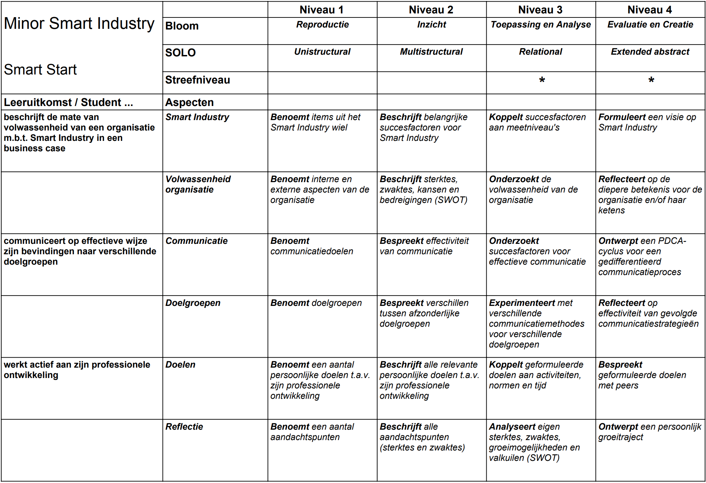

# Inleiding

De Minor Smart Industry van de Hogeschool Arnhem en Nijmegen is een verbredende Minor. Studenten vanuit verschillende opleidingen verkennen nieuwe technologieën en leren hoe hiermee waarde kan worden gecreëerd. Tijdens het studietraject leren ze het belang van samenwerking, kennisdeling en continuous improvement voor het innovatievermogen van organisaties.

```{r smartindustry, echo=FALSE, fig.align='center', fig.cap="Smart Industry model", out.width="40%", warning=FALSE}
knitr::include_graphics('images/smartindustry.jpg')
```

Het studieprogramma bestaat uit vijf onderdelen/modules:

* Smart Start - Onderzoek en communicatie en professionele ontwikkeling
* Smart Business - Bedrijfskundige toepassingen van Smart Technologies
* Smart Connection - Digitalisering en netwerken
* Smart Technology - Hardware
* Project

In dit portfolio zal de toetscyclus binnen Smart Start worden doorgenomen en besproken. Dit onderdeel heeft een aandeel van 20% in het gehele programma (6 ECTS / 168 SBU). Studenten moeten bewijzen dat ze zich op volgende competenties hebben ontwikkeld:

* Student beschrijft de mate van volwassenheid van een organisatie m.b.t. Smart Industry in een business case
* Student communiceert op effectieve wijze zijn bevindingen naar verschillende doelgroepen
* Student werkt actief aan zijn professionele ontwikkeling

Bij het thema Smart Industry spelen zaken als innovatie en disruptie een belangrijke rol. Dit houdt in dat omgang met onzekerheid, initiatief nemen en creatief vermogen succesfactoren zijn, zowel voor de individuele professional als de organisatie die Smart(er) wil worden. 

# Toetscyclus

```{r toetscyclus, echo=FALSE, fig.align='center', fig.cap="Toetscyclus", out.width="40%", warning=FALSE}
knitr::include_graphics('images/toetscyclus.png')
```

Om de kwaliteit van het toetsingsproces van Smart Start te beoordelen zijn alle stappen uit de toetscyclus doorgenomen en geanalyseerd. Daarbij zijn volgende zaken opgevallen:

* Basisontwerp: ---
* Toetsmatrijs: ---
* Toetsconstructie en normering: ---
* Afnemen: ---
* Beoordelen, verwerken en analyseren: ---
* Registreren en communiceren: ---
* Evalueren

<<Verdiepende literatuurstudie>>
Continuous Assessment is een combinatie van formatief en summatief toetsen
Voordelen en nadelen
Condities voor optimaal effect
Ontwerpprincipes

## Basisontwerp

Gezien het brede character van de competenties en de eerdergenoemde succesfactoren is ervoor gekozen om bij de formulering van beoordelingscriteria niet teveel detail aan te brengen. Door op meerdere momenten tijdens het semester bewijslast aan te leveren en te reflecteren op de kwaliteit, kunnen studenten hun groei naar en bereiken van afzonderlijke comptenties ervaren en aantonen (continuous assessment).

Bij continuous assessment wordt toetsing verdeeld over meerdere momenten in een studietraject, in plaats van een enkel afsluitend tentamen aan het einde. Uit onderzoek blijkt dat dit drie voordelen biedt voor het leereffect van de student [@dayExplainingIndividualStudent2018b].

Ten eerste is er het zogenaamde testing effect [@roediger2006power] oftewel de kracht van herhaling. Door vaker te oefenen met de materie blijft informatie beter beklijven. Een volgend voordeel van continuous assessment is het spacing effect. Door meer tijd in te bouwen tussen herhalingen van studiestof, wordt het leereffect verhoogd [@kornell2009optimising]. Het derde effect heeft te maken met reflectie [@moon1999reflection]. Anders dan bij eenmalig toetsen, biedt herhaald toetsen ruimte voor de student om te reflecteren op zijn prestaties.

Binnen de context van de minor is er nog een aanvullend positief effect. Door meer casussen te onderzoeken, creëert de student een grotere ervaringsset, waaruit hij later meer inspiratie kan putten.


## Ontwerp toetsmatrijs

Een toetsmatrijs is een instrument waarmee de toetsontwerper kan beoordelen of in welke mate de toets daadwerkelijk alle geformuleerde competenties meet en of de manier van meten voldoende betrouwbaar is (bijv. of iedere student op hetzelfde niveau wordt getest).

Het helpt de constructeur bovendien zich te beperken tot een vragenset die MECE is - volledig en zonder overlap. Dit bespaart tijd bij het maken van de toets en de beoordeling [@AnimationHowCreate].

```{r toetsmatrijs, echo=FALSE, fig.align='center', fig.cap="Toetsmatrijs Smart Start", out.width="100%", warning=FALSE}

```

## Construeren toets en normen

Studenten ontwerpen hun eigen Journey en bepalen wanneer ze beoordeeld willen worden. Normering in rubric.

## Afnemen

Binnen de module Smart Start zijn een aantal thema's geformuleerd waarnaar studenten onderzoek kunnen doen:

* Waardepropositie
* Processen
* Organisational Capital
* Human Capital

Studenten onderzoeken minimaal drie thema's. Hierbij maken ze de koppeling met Smart Industry en ontwerpen een meetinstrument om de volwassenheid van een organisatie op dit gebied te meten. Studenten worden aangemoedigd te experimenteren en krijgen maximale autonomie wat betreft vorm, inhoud en volgorde.

Uiteindelijke worden alle bewijzen verzameld in een persoonlijk portfolio. Een voorbeeld hiervan vind u [hier](https://minorsmart.github.io/personal-portfolio-coengoossens78/index.html). Dit portfolio kunnen studenten gebruiken voor hun personal branding (bijv. op Linkedin).

## Beoordelen, verwerken en analyseren

Al het ingeleverd werk wordt verzameld in het Learning Management Systeem van de opleiding (Moodle). Per deelproduct (zie beschrijving onder "Afnemen") i
Rubric, Moodle Logs, Dataiku

## Registreren en communiceren

Inlevermodule Moodle

## Evalueren

Kwaliteitssurveys

# Verbetervoorstellen

Tekst

# Persoonlijke reflectie

Tekst

# Bibliografie

<div id="refs"></div>

# (APPENDIX) Bijlagen {-} 

# Voorbeeld 1

# Voorbeeld 2

